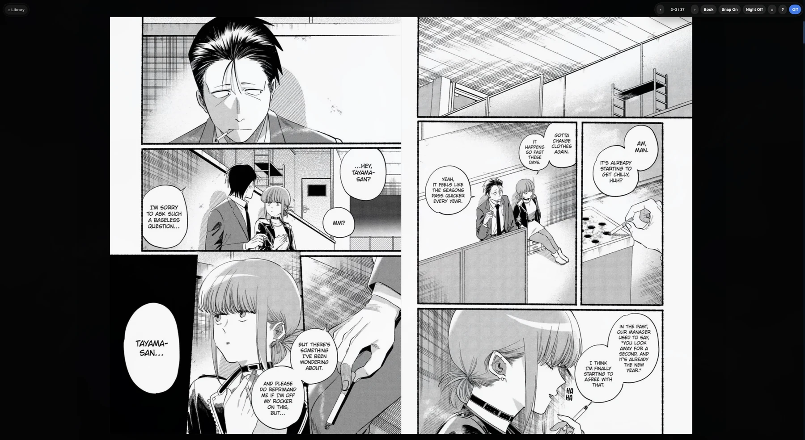

<div align="center">
  <h1>FRANK Scanlation</h1>

  <p>
    <strong>A Kindle-like desktop reader for ad-hoc scanlation websites.</strong><br>
    Paste a site URL, get a library card with cover art, chapter tracking,
    and new-chapter notifications. Read on Linux, macOS, and Windows.
  </p>

  <p>
    
    
  </p>
</div>

---

## What it looks like

Your library: paste a site URL, get a card with cover art, reading
status, and a NEW badge when unread chapters land.


Reading: the site opens in place with the Prettify Manga Reader overlay
injected — here a double-page spread, fitted to a maximized window,
with the ⌂ Library button to get back home.



## What it is

Scanlation sites are ad-bloated, bright, one-long-scroll pages. This app is
the third member of a small family:

- [prettify-manga-reader](https://github.com/akitaonrails/prettify_manga_reader)
  — a browser extension that overlays a dark, page-fitted, spread-joining
  reader on top of those sites.
- [FRANK MANGA+](https://github.com/akitaonrails/frank_mangaplus) — a Tauri
  desktop client for the official MANGA Plus service.
- **FRANK Scanlation** (this repo) — the two combined: a Tauri desktop app
  whose reader windows load scanlation sites directly and inject the
  extension's reader into every page.

Nothing is hardcoded to any website. The same heuristics the extension uses
(image-sequence scoring, chapter-number families in URLs, conservative
next/previous-chapter detection) drive everything here, on both sides of
the fence:

- **JS side** (`desktop/src-tauri/injected/reader.js`, injected into reader
  windows): detects the manga pages, builds the dark overlay with
  Single/Double/Book spreads, night filter, keyboard navigation, and
  end-of-chapter next/prev cards. It auto-opens on chapter-looking URLs.
- **Rust side** (`core/`): parses chapter numbers out of navigated URLs to
  track reading progress, and extracts title/cover/chapter list from a
  site's HTML when you add it or when the background checker polls it.

## Features

- **Library grid** with cover art pulled from each site (`og:image` and
  friends), reading status, and a NEW badge when unread chapters exist.
- **Add by URL**: paste something like
  `https://zom-100-bucket-list-of-the-dead.online/` and the title, cover,
  and latest chapter are extracted automatically.
- **Continue ▶** opens the chapter *after* the last one you read (the
  chapter list is refetched on the fly); falls back to where you left off.
- **Progress tracking without site cooperation**: the reader window is a
  real webview pointed at the site; Rust watches its page loads and records
  chapter numbers parsed from the URLs. Remote pages get no IPC access.
- **Background new-chapter checks** shortly after launch and every 6 hours,
  with desktop notifications.
- **Reader** (injected on every page): `Space`/arrows to flip
  pages/spreads, `D` cycles Single → Double → Book, `N` cycles the night
  filter, `S` toggles scroll snap, `Enter`/`Backspace` jump chapters, `?`
  for help. Mode choice is remembered per manga.

## Where data lives

| OS | Path |
|---|---|
| Linux | `~/.config/frank-scanlation/` (honors `XDG_CONFIG_HOME`) |
| macOS | `~/.config/frank-scanlation/` |
| Windows | `%APPDATA%\frank-scanlation\` |

`library.db` is the SQLite library; `covers/` holds downloaded cover art.
Reader-mode preferences live in each site's localStorage inside the
webview.

## Layout

```
core/                     scanlation-core: heuristics, HTML extraction,
                          SQLite library, HTTP fetcher (no Tauri deps)
desktop/                  SvelteKit (bun) frontend — the library grid
desktop/src-tauri/        Tauri 2 app: commands, reader windows,
                          background checker
desktop/src-tauri/injected/  reader.js + reader.css injected into reader
                          windows (ported from the browser extension)
```

## Development

```bash
# Rust tests + lints
cargo test --workspace
cargo clippy --workspace --lib --tests -- -D warnings
cargo fmt --check

# Frontend unit tests + injected-reader tests (node:vm harness)
cd desktop
bun install
bun run test

# Run the app
bun run tauri dev

# Release bundles for the host platform
bun run tauri build
```

## CI / Releases

GitHub Actions mirror the FRANK MANGA+ setup:

- `ci.yml` — tests, clippy, rustfmt, vitest + node tests, frontend build on
  Linux/macOS/Windows.
- `release.yml` — tag `v*` builds Linux (AppImage/deb/rpm), macOS
  (Apple Silicon, signed + notarized), and Windows (NSIS/MSI) bundles and
  publishes a GitHub release. Requires these repository secrets for macOS:
  `APPLE_CERTIFICATE`, `APPLE_CERTIFICATE_PASSWORD`,
  `APPLE_SIGNING_IDENTITY`, `APPLE_ID`, `APPLE_PASSWORD`, `APPLE_TEAM_ID`
  (optional: `TAURI_SIGNING_PRIVATE_KEY`,
  `TAURI_SIGNING_PRIVATE_KEY_PASSWORD`).
- `aur-publish.yml` — publishes `frank-scanlation-bin` to the AUR after a
  release. Requires `AUR_USERNAME`, `AUR_EMAIL`, `AUR_SSH_PRIVATE_KEY`.

> App icons are generated from `docs/icon.png` — after changing it, rerun
> `bunx tauri icon ../docs/icon.png` from `desktop/`.

## Disclaimer

Personal-use reader. It doesn't host, proxy, or rehost any content — the
reader windows load the sites you point them at, ads and all; the overlay
is cosmetic and local. Support the official releases of the manga you read.

## License

MIT.
